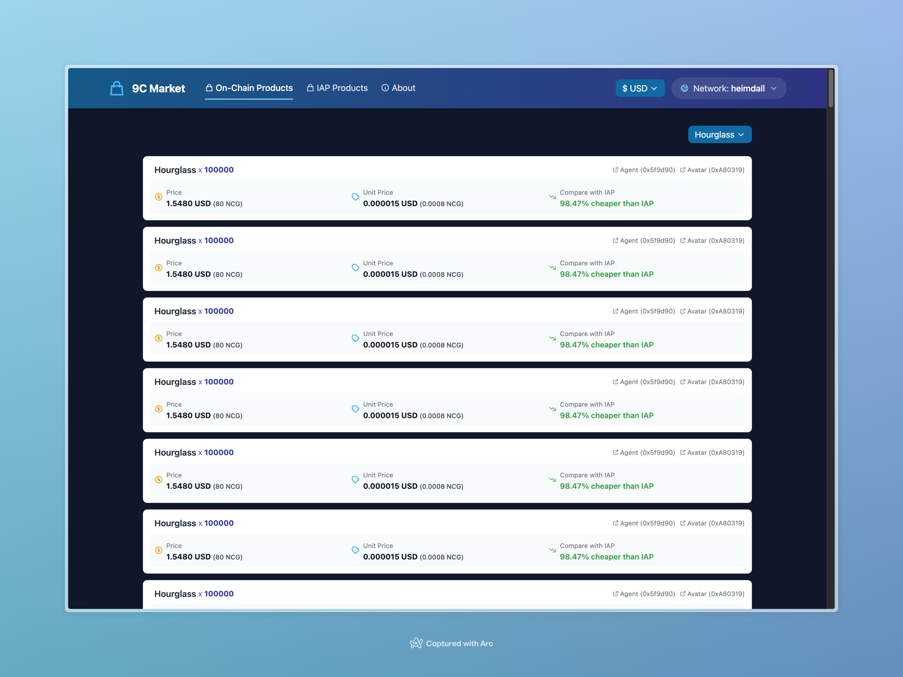

# 9c-market



A web service that helps users browse and compare on-chain market products and IAP (In-App Purchase) products of Nine Chronicles, a fully on-chain game powered by [planetarium/libplanet](https://github.com/planetarium/libplanet) and [planetarium/lib9c](https://github.com/planetarium/lib9c).

## Development

Run development server:

```
yarn dev
```

## Deploy

### With fly.io

Deploy with fly.io:

```
flyctl deploy
```

### Others

Build Docker image to deploy:

```
docker build .
```

## License

This project is licensed under AGPL-3.0. This is because this project depends on the `/marketProvider{Odin,Heimdall}` endpoints of https://api.9capi.com/, which may be proxy endpoints of [planetarium/market-service](https://github.com/planetarium/market-service), and the market-service is licensed under AGPL-3.0.
